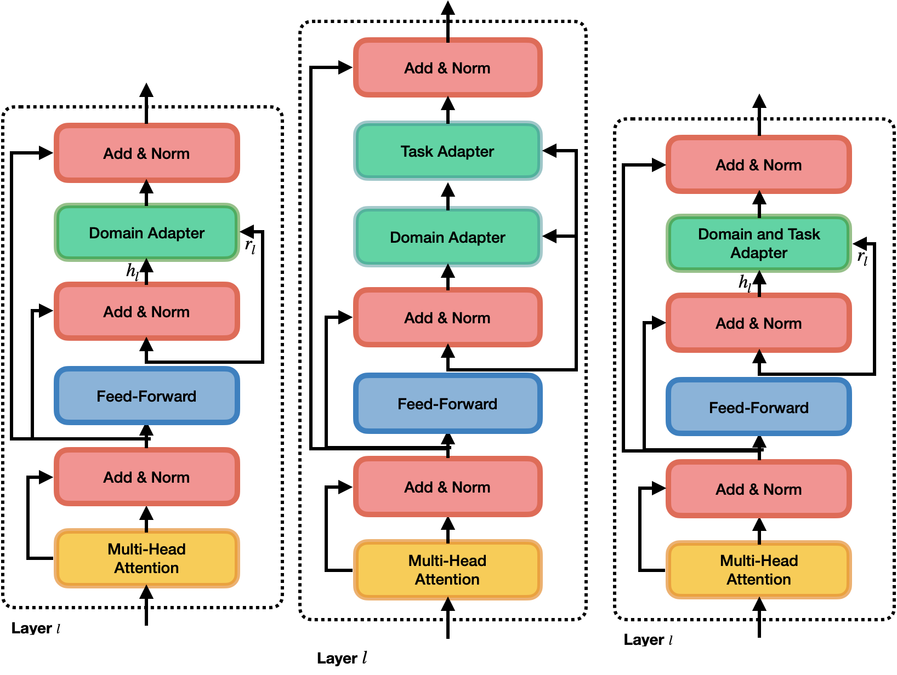

# UDApter - Efficient Domain Adaptation Using Adapters

Code for our paper at `EACL'23: UDAPTER-Efficient Domain Adaptation Using Adapters`. `Domadapter` trains adapters for Domain Adaptation in NLP. The idea is to use principles 
of unsupervised domain adaptation and parameter efficient fine-tuning to make domain 
adaptation more efficient. 

<p align="center">
  
</p>


## Use with adapter-transformers and :hugs:
The weights are now available at https://huggingface.co/domadapter


# Training Requirements


- Python >= 3.8
- [Poetry](https://python-poetry.org/) for dependency and environment management
- [direnv](https://direnv.net/) (Optional) - For automatically exporting environment variables

## Environment Variables 
We use environment variables to store certain paths

- Pretrained Transformer Models (PT_MODEL_CACHE_DIR)
- Datasets (DATASET_CACHE_DIR)
- Experiments (OUTPUT_DIR)
- Results (OUTPUT_DIR)

Change the following variables in the .envrc file.

- `export DATASET_CACHE_DIR=""`
- `export PT_MODELS_CACHE_DIR=""`
- `export OUTPUT_DIR=""`

Run `source .envrc`


## Installation

### Creating a virtualenv

- Run `poetry install` to install the dependencies
- Use `poetry shell` to create a virtual environment

> Commit your `poetry.lock` file if you install any new library.

Note: We have tested this on a linux machine. If you are using Macbook M1 then you might encounter in to 
some errors installing scipy, sklearn etc. 

## Download Datasets

- Run `domadapter download mnli` to download the `mnli` dataset
- Run `domadapter download sa` to download the `amazon` dataset.

> Using Google Colab?
`!pip install pytorch-lightning==1.4.2 datasets transformers pandas click wandb numpy rich`


## Get results Instantaneously 
You can run this on CPU and it will take a couple of minutes 

**Join Domain Task Adapter for MNLI**
```
domadapter results mnli-joint-dt --source [source_domain] --target [target_domain]
```
For MNLI, The source and target domain can be one of `Fiction, Slate, Government, Telephone, Travel`

Other models and other datasets are coming soon.
## Train Models 

See the `scripts` folder to train models. 
For example to train the ***Joint-DT-:electric_plug:*** on the MNLI dataset run 

`bash train_joint_da_ta_mnli.sh`


## Relevant folders
```
.
├── commands (domadapter terminal commands)
├── datamodules (Pytorch Lightning DataModules to load the SA and MNLI Dataset)
├── divergences (Different Divergence measures)
├── models (All the models listed in the paper)
├── orchestration (Instantiates the model, dataset, trainer and runs the experiments)
├── scripts (Bash scripts to run experiments)
├── utils (Useful utilities)
└── console.py (Python `Rich` console to pretty print everything)
```

---

## Citations 

```
@misc{https://doi.org/10.48550/arxiv.2302.03194,
  doi = {10.48550/ARXIV.2302.03194},
  
  url = {https://arxiv.org/abs/2302.03194},
  
  author = {Malik, Bhavitvya and Kashyap, Abhinav Ramesh and Kan, Min-Yen and Poria, Soujanya},
  
  keywords = {Computation and Language (cs.CL), FOS: Computer and information sciences, FOS: Computer and information sciences},
  
  title = {UDApter -- Efficient Domain Adaptation Using Adapters},
  
  publisher = {arXiv},
  
  year = {2023},
  
  copyright = {Creative Commons Attribution 4.0 International
}
```
